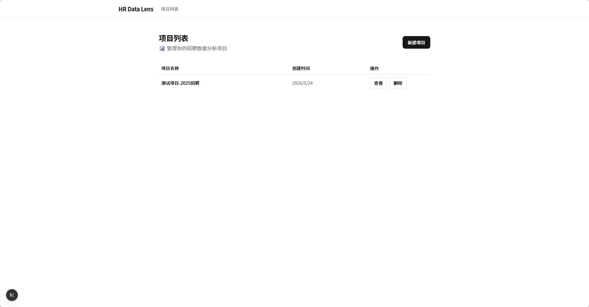
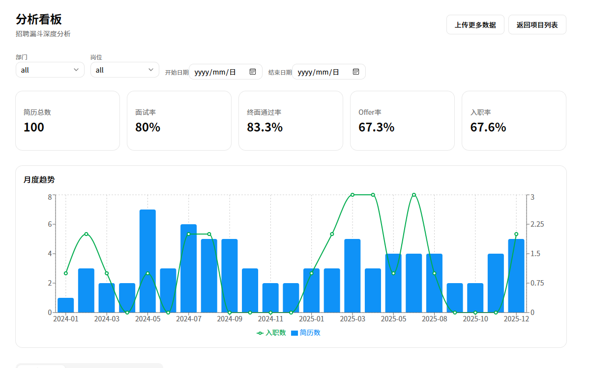
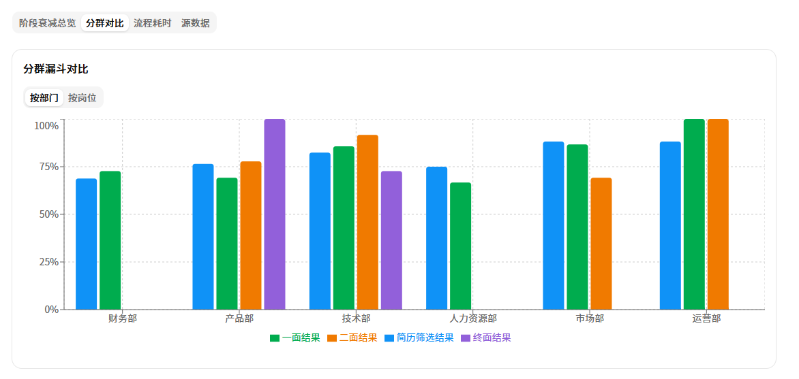
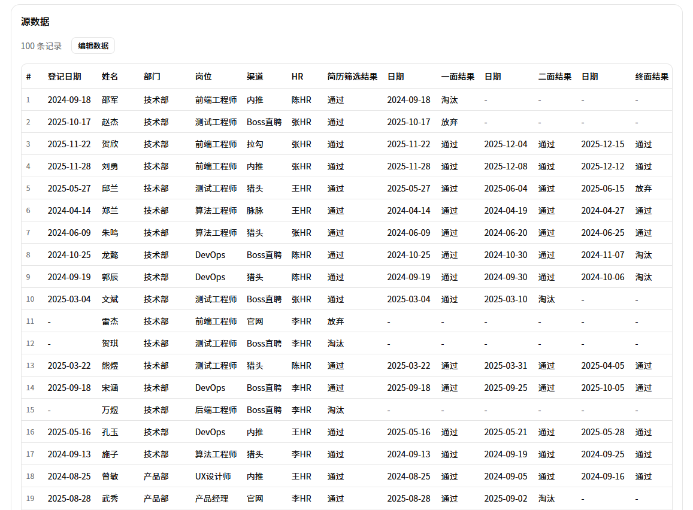

# HR Data Lens

轻量招聘数据分析工具 — 上传招聘漏斗 Excel，自动生成超越简单漏斗的深度分析。

## 功能

- **📤 Excel/CSV 上传** — 拖拽上传，自动识别列类型（信息列 / 阶段列）
- **📊 KPI 指标卡** — 简历总数、面试率、终面通过率、Offer率、入职率
- **📈 月度趋势图** — 双轴展示简历量与入职量变化
- **🔻 阶段衰减漏斗** — 各阶段转化率可视化，自动标注异常环节
- **🏷️ 分群对比** — 按部门 / 岗位拆分对比各阶段转化率
- **⏱️ 流程耗时分析** — 阶段间平均/最短/最长间隔天数
- **✏️ 源数据编辑** — 可编辑表格，下拉选择结果，修改实时生效
- **🔍 筛选器** — 部门 / 岗位 / 日期范围筛选

## 截图


### 首页
项目列表，创建和管理分析项目。



### 分析看板
KPI 指标卡 + 月度趋势图 + 筛选器。



### 阶段衰减漏斗
各阶段转化率可视化，一眼看出瓶颈环节。



### 源数据编辑
可编辑原始数据表格，修改实时生效。



## 本地运行

```bash
# 1. 克隆项目
git clone https://github.com/FinchS1018/hr-data-lens.git
cd hr-data-lens

# 2. 安装依赖（自动生成 Prisma 客户端）
npm install

# 3. 初始化数据库（创建 SQLite 表结构）
npx prisma migrate deploy

# 4. 启动开发服务器
npm run dev
```

打开浏览器访问 **http://localhost:3000**（如果端口被占用，终端会提示实际端口号）。

### 首次启动完整流程说明

| 步骤 | 命令 | 作用 |
|------|------|------|
| 安装依赖 | `npm install` | 下载所有 npm 包，`postinstall` 钩子会自动执行 `npx prisma generate` 生成数据库客户端代码 |
| 建表 | `npx prisma migrate deploy` | 在本地创建 `prisma/dev.db` SQLite 数据库文件，执行迁移建表 |
| 启动 | `npm run dev` | 启动 Next.js 开发服务器 |

之后每次使用只需 `npm run dev`，无需重复前三步。

### 生成测试数据

```bash
node -e "
const XLSX = require('xlsx');
const wb = XLSX.utils.book_new();
const ws = XLSX.utils.aoa_to_sheet([
  ['姓名','部门','岗位','渠道来源','招聘负责人','简历筛选结果','一面结果','二面结果','终面结果','Offer结果','是否入职'],
  ['张三','技术部','前端工程师','Boss直聘','李HR','2025-01-15','2025-01-22','2025-02-05','通过','已发','是'],
  ['李四','产品部','产品经理','内推','王HR','2025-01-16','2025-01-28','淘汰','','未发','否'],
  ['王五','技术部','后端工程师','猎头','李HR','2025-02-01','2025-02-10','2025-02-20','通过','已接受','是'],
  ['赵六','市场部','内容运营','官网','张HR','2025-02-05','淘汰','','','未发','否'],
]);
XLSX.utils.book_append_sheet(wb, ws, '招聘数据');
XLSX.writeFile(wb, 'sample.xlsx');
console.log('sample.xlsx created');
"
```

## 上传数据格式

上传 Excel/CSV 文件，需包含以下列（列名支持中英文自动识别）：

| 列类型 | 示例列名 | 说明 |
|--------|---------|------|
| 信息列 | 姓名、部门、岗位、渠道来源、招聘负责人 | 候选人基本信息 |
| 阶段列 | 简历筛选结果、一面结果、二面结果、终面结果 | 值为日期（表示通过）或 淘汰/放弃/待定 |
| 其他 | Offer结果、是否入职 | 录用与入职状态 |

## 技术栈

| 层面 | 选型 |
|------|------|
| 框架 | Next.js 16 (App Router) |
| UI | Tailwind CSS v4 + shadcn/ui |
| 图表 | Recharts |
| 数据库 | SQLite (Prisma v7) |
| 表格 | @tanstack/react-table |
| Excel 解析 | xlsx (SheetJS) |
| 文件上传 | react-dropzone |

## 项目地址

https://github.com/FinchS1018/hr-data-lens
